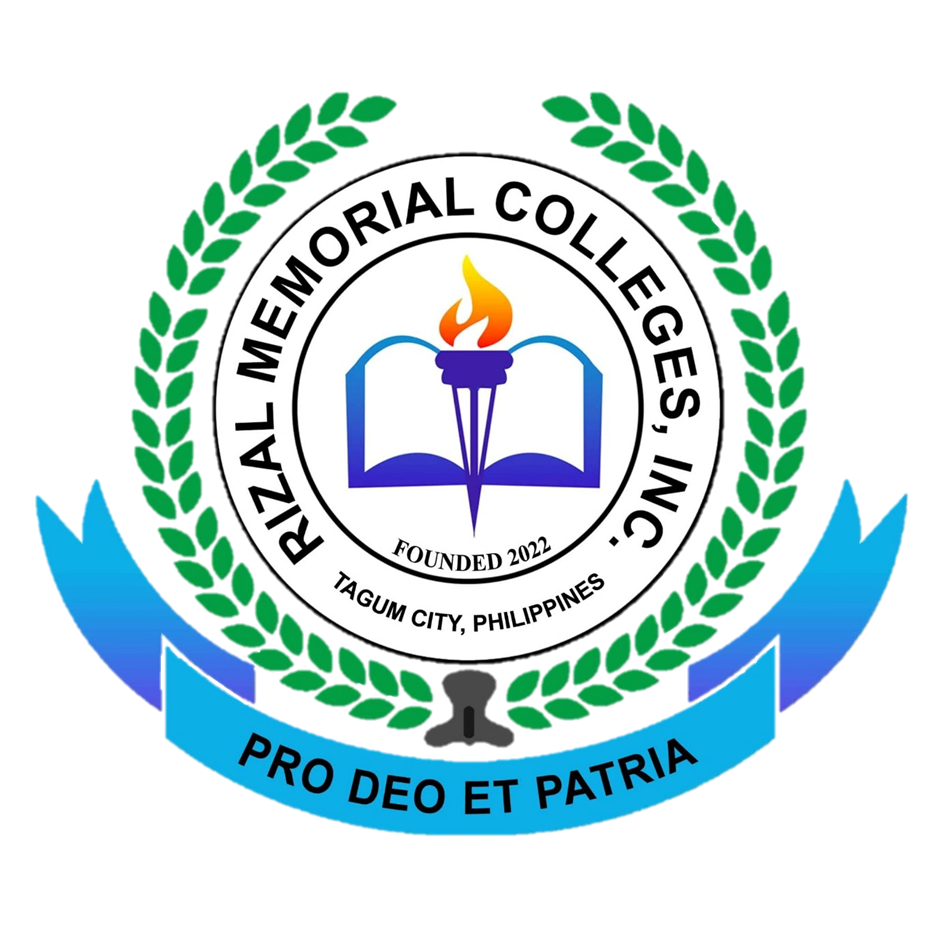
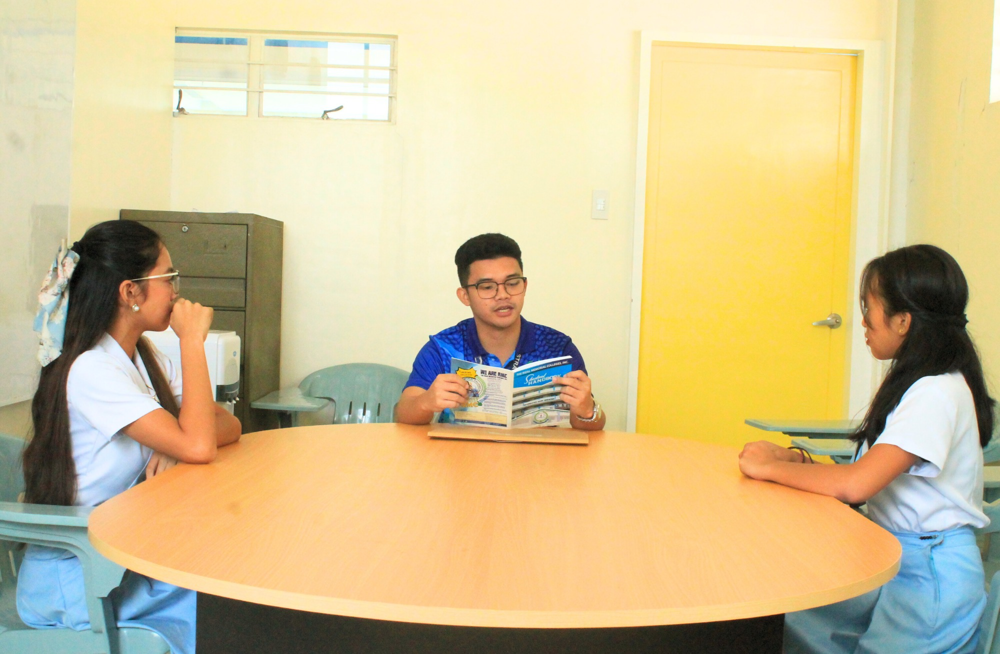

<!DOCTYPE html>
<html lang="en">
<head>
    <meta charset="UTF-8">
    <meta name="viewport" content="width=device-width, initial-scale=1.0">
    <title>RMC Tagum School Portal</title>
    <link rel="icon" type="image/png" href="logo.png">
    <link rel="stylesheet" href="firstpage.css">
    <link rel="stylesheet" href="https://cdnjs.cloudflare.com/ajax/libs/font-awesome/6.4.0/css/all.min.css">
</head>
<body>
    <!-- Navbar -->
    <nav class="navbar">
        

            
            

                <h1>RMC Tagum</h1>
                <h2>School Portal</h2>
            

        

        <ul class="nav-links">
            <li><a href="#about">About Us</a></li>
            <li><a href="#home">Home</a></li>
            <li><a href="#contact" class="contact-link">Contact</a></li>
        </ul>
    </nav>

    <!-- Main Content -->
    

        

            <h1>Our Mission</h1>
            
The RMC Community is keeping up to produce "cream of the crop" graduates who are research-driven and community service-oriented, globally competitive, and life-long learners.

            
            
Established as a private educational institution committed to the task of upholding the laws of the Republic, in keeping with the spirit of the Philippine Constitution, and with the goals and objectives of the Department of Education and the Commission on Higher Education and TESDA, Rizal Memorial Colleges seeks to educate the Filipino in consonance with the development of a total person regardless of sex, race, age or economic status.

            
            

                
This philosophy of RMC is expressed by the school motto:

                <h2 class="motto">Pro Deo Et Patria</h2>
                
(For God And Country)

            

            
            

                <button class="portal-btn">Student</button>
                <button class="portal-btn">Faculty</button>
            

        

        
        

            

                
                

                    
                

            

        

    

    <!-- Footer -->
    <footer class="footer">
        

            

                <i class="far fa-envelope"></i>
                <a href="mailto:admissions.rmctagum@gmail.com">admissions.rmctagum@gmail.com</a>
            

            

                <i class="fab fa-facebook-f"></i>
                <a href="https://www.facebook.com/RMCTagumBranchOfficial/">Rizal Memorial Colleges, Inc. Tagum</a>
            

            

                <i class="fas fa-map-marker-alt"></i>
                <a href="https://www.google.com/maps/place/The+Rizal+Memorial+Colleges,+Inc.+(RMC+Tagum)/@7.4531811,125.7873948,17z/data=!3m1!4b1!4m6!3m5!1s0x32f953e3f5abe0d3:0xa2cce2354cab54ca!8m2!3d7.4531811!4d125.7899697!16s%2Fg%2F11rk35slc3?entry=ttu&g_ep=EgoyMDI1MDMzMC4wIKXMDSoASAFQAw%3D%3D">Purok Gulayan Bolzer Avenue, Brgy.Mankilam, Tagum City</a>
            

        

    </footer>
    <section class="about-us-section">
        

            

                <h2>About RMC Tagum</h2>
                
Dedicated to excellence in education, we shape future leaders through comprehensive learning and holistic development.

            

            
            <!-- Add MVE boxes -->
           
            

                

                    <h3>Our Story</h3>
                    
Since our establishment, RMC Tagum has been committed to providing quality education to students in Tagum City and neighboring areas, fostering academic excellence and personal growth.

                

                
                

                    <h3>Our Excellence</h3>
                    
We take pride in our state-of-the-art facilities, dedicated faculty, and comprehensive curriculum that ensures the holistic development of our students.

                

                
                

                    <h3>Our Future</h3>
                    
As we continue to grow, we remain committed to our vision of becoming one of the leading private educational institutions in the ASEAN region.

                

            

            
            <!-- Move MVE boxes here -->
            

                

                    <h3><i class="fas fa-bullseye"></i> Our Mission</h3>
                    
The RMC Community is keeping up to produce "cream of the crop" graduates who are research-driven and community service-oriented, globally competitive, and life-long learners.

                

                
                

                    <h3><i class="fas fa-eye"></i> Our Vision</h3>
                    
To be a leading educational institution in the ASEAN region, recognized for academic excellence, research innovation, and community engagement.

                

                
                

                    <h3><i class="fas fa-book-reader"></i> Educational Philosophy</h3>
                    
We believe in holistic education that nurtures not just academic excellence but also character development, critical thinking, and social responsibility, guided by our motto "Pro Deo Et Patria".

                

            

            
            

                <h2>WHY CHOOSE RMC TAGUM?</h2>
                
Discover what sets us apart as your educational partner

            

            
            

                

                    <h3>Academic Excellence</h3>
                    
With consistently high board exam passing rates and award-winning academic programs, we maintain standards that prepare students for professional success.

                

                
                

                    <h3>Modern Facilities</h3>
                    
Our campus features state-of-the-art laboratories, a comprehensive library, smart classrooms, and modern sports facilities to support holistic learning.

                

                
                

                    <h3>Expert Faculty</h3>
                    
Learn from industry practitioners and experienced educators who bring real-world knowledge and innovative teaching methods to the classroom.

                

                

                    <h3>Strategic Location</h3>
                    
Conveniently located in Tagum City, our campus is easily accessible while providing a conducive environment for learning and personal growth.

                

                

                    <h3>Industry Partnerships</h3>
                    
Strong connections with local and international companies provide students with internship opportunities and potential career placements.

                

                

                    <h3>Student Support</h3>
                    
Comprehensive support services including career counseling, academic advising, and student organizations ensure your success throughout your academic journey.

                

            

            
            

                <h2>ACADEMIC PROGRAMS</h2>
                
Explore our comprehensive range of academic offerings

            

            
            

                

                    <h3>Bachelor of Science in Criminology </h3>
                    
Specializing in software development, web technologies, networking, and database management. Our IT program prepares students for the evolving tech industry.

                

                
                

                    <h3>Bachelor of Science in Psychology </h3>
                    
Major in Marketing Management, Financial Management, and Human Resource Management. Developing future business leaders with strong management and entrepreneurial skills.

                

                
                

                    <h3>Bachelor in Human Services </h3>
                    
Preparing competent educators with specializations in Early Childhood Education and Special Education, equipped with modern teaching methodologies.

                

                

                    <h3>Bachelor of Early Childhood Education </h3>
                    
Offering majors in English, Mathematics, Science, and Social Studies. Training future teachers with expertise in specific subject areas.

                

                

                    <h3>Bachelor of Special Needs Education </h3>
                    
Focus on hotel operations, food and beverage management, events planning, and tourism. Preparing students for the global hospitality industry.

                

                 
                

                    <h3>Bachelor of Science in Agriculture </h3>
                    
Academic Tracks: STEM, ABM, HUMSS, TVL-Cookery, and TVL-ICT tracks preparing students for college and career readiness.

                

                

                    <h3>Senior High School Programs</h3>
                    
Academic Tracks: STEM, ABM, HUMSS, TVL-Cookery, and TVL-ICT tracks preparing students for college and career readiness.

                

                

                    <h3>Junior High School</h3>
                    
Grades 7-10 curriculum following K-12 standards with emphasis on core subjects, values formation, and holistic development. Features specialized programs in Science, Technology, and Arts.

                

                

                    <h3>Elementary Education</h3>
                    
Grades 1-6 offering strong foundation in basic education with integrated programs in English, Mathematics, Science, and Filipino. Includes special programs in Music, Arts, and Physical Education.

                

            

            
            

            
            

                <h2>INQUIRE NOW</h2>
                
Take the first step towards your future with RMC Tagum

            

            
            

                

                    <h3>Ready to Begin Your Journey?</h3>
                    
Get in touch with our admissions team to learn more about our programs, requirements, and enrollment process.

                    <button class="inquire-btn" onclick="document.querySelector('.contact-link').click()">Inquire Now</button>
                

                
                

                    <h3>Admission Requirements</h3>
                    
Learn about our admission process and prepare your requirements for a smooth enrollment experience.

                    <button class="inquire-btn" onclick="document.querySelector('.contact-link').click()">Contact Admissions</button>
                

                
                

                    <h3>Schedule a Campus Visit</h3>
                    
Experience our campus firsthand and meet with our program advisors to discuss your educational goals.

                    <button class="inquire-btn" onclick="document.querySelector('.contact-link').click()">Book a Visit</button>
                

            

        

    </section>
    <section id="contact" class="contact-section">
        <button class="contact-back-btn" aria-label="Go back"></button>
        

            

                <h2>Contact us</h2>
                <form id="contactForm">
                    

                        <input type="text" placeholder="Enter your name" required>
                    

                    

                        <input type="email" placeholder="Enter your email" required>
                    

                    

                        
What is it about?

                        

                            <label>
                                <input type="radio" name="inquiry" value="enrollment" required>
                                Enrollment Inquiry
                            </label>
                            <label>
                                <input type="radio" name="inquiry" value="general">
                                General Information
                            </label>
                            <label>
                                <input type="radio" name="inquiry" value="academic">
                                Academic Programs
                            </label>
                            <label>
                                <input type="radio" name="inquiry" value="support">
                                Student Support & Counseling
                            </label>
                            <label>
                                <input type="radio" name="inquiry" value="accommodation">
                                Accommodation
                            </label>
                            <label>
                                <input type="radio" name="inquiry" value="policies">
                                School Policies
                            </label>
                            <label>
                                <input type="radio" name="inquiry" value="facilities">
                                Facilities and Resources
                            </label>
                            <label>
                                <input type="radio" name="inquiry" value="feedback">
                                Feedback & Suggestions
                            </label>
                            <label>
                                <input type="radio" name="inquiry" value="others">
                                Others
                            </label>
                        

                    

                    <button type="submit" class="next-btn">NEXT</button>
                </form>
            

            

                
            

        

    </section>

    <button class="back-btn" aria-label="Go back"></button>
    <h2>Sign In</h2>
    <form class="login-form">
        

            <input type="text" placeholder="I.D. Number" required>
        

        

            <input type="email" placeholder="Email" required>
        

        

            <input type="password" placeholder="Password" required>
        

        

            

                <input type="checkbox" id="remember">
                <label for="remember">Remember me</label>
            

            <a href="#" class="forgot-password">Forgot Password</a>
        

        <button type="submit" class="login-btn">Sign In</button>
        
Don't have an account? <a href="#">Sign up</a>

    </form>

    

    <!-- Firebase SDK -->
    <!-- After Firebase SDK scripts and before firstpage.js -->
    
    
    
    
    
    
</body>
</html>
<!-- Add this inside the login-section, after the login form -->

    <button class="back-btn" aria-label="Go back"></button>
    <h2>Sign Up</h2>
    <form class="signup-form">
        

            <input type="text" placeholder="Full Name" required>
        

        

            <input type="email" placeholder="Email" required>
        

        

            <input type="password" placeholder="Password" required>
        

        

            <input type="password" placeholder="Confirm Password" required>
        

        <button type="submit" class="signup-btn">Sign Up</button>
        
Already have an account? <a href="#" class="login-link-btn">Sign In</a>

    </form>

    <button class="back-btn" aria-label="Go back"></button>
    <h2>Reset Password</h2>
    <form class="forgot-password-form">
        

            <input type="email" placeholder="Enter your email address or contact number" required>
        

        <button type="submit" class="reset-btn">Reset Password</button>
        
Remember your password? <a href="#" class="login-link-btn">Sign In</a>

    </form>

      
      

  
